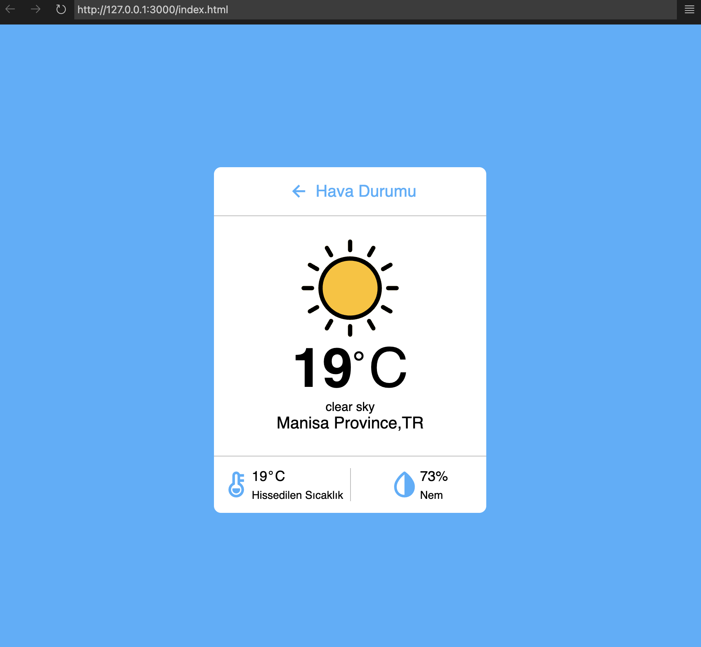
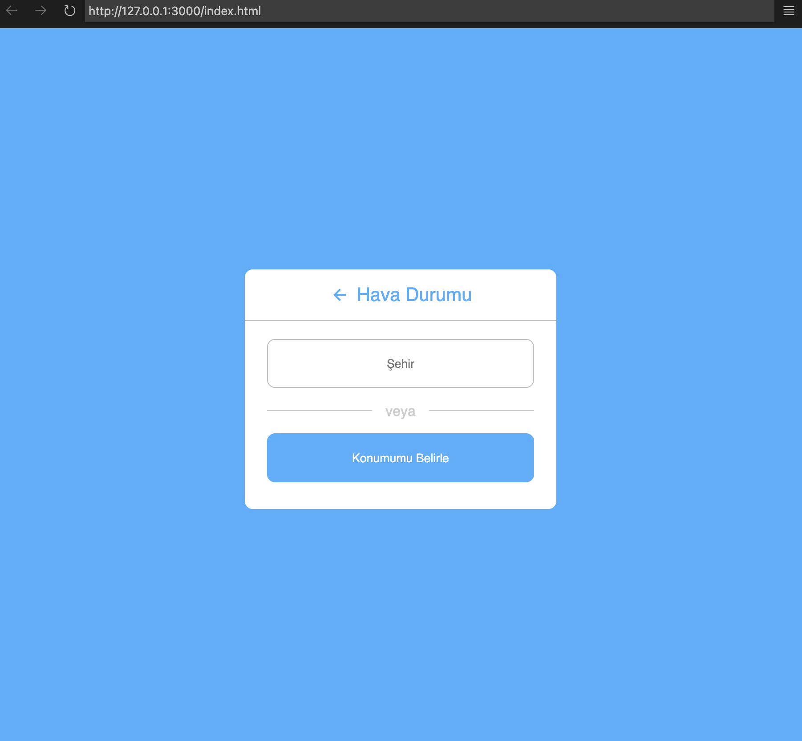

# Weather App projesi

## Özellikler

Proje çalıştırıldığında, tarayıcınızda projenin çalışan bir örneği görüntülenecektir. Kullanıcılar, istediği şehrin hava durumunu inputa girerek öğrenebilir ya da "konumumu belirle" butonu ile konumundaki hava durumunu öğrenebilir.

## Kurulum

1. Projeyi klonlayın: `git clone https://github.com/your-username/your-project.git`
2. Proje dizinine gidin: `cd your-project`
3. Gerekli bağımlılıkları yükleyin: `npm install`

## Kullanım

Proje bağımlılıklarını yükledikten sonra, aşağıdaki komutları kullanarak projeyi başlatabilirsiniz:npm start

## Ekran Görüntüleri

## İletişim

Eğer projem hakkında sorularınız veya geri bildirimleriniz varsa, benimle [nejat.980@hotmail.com] adresinden iletişime geçebilirsiniz.

